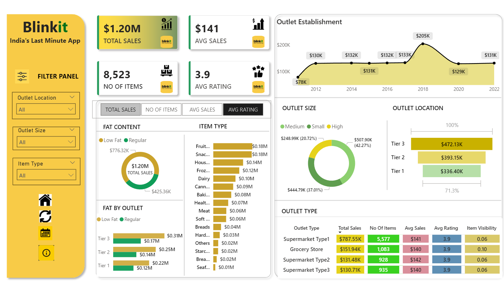

# Blinkit Grocery Sales Analysis

## Project Overview
This project analyzes Blinkit grocery sales data using SQL, Python, and Power BI to identify sales trends, outlet performance, customer preferences, and business insights.

---

## Tools & Technologies
- SQL
- Python
- Pandas
- NumPy
- Matplotlib
- Seaborn
- Power BI

---

## Project Workflow
1. Data Collection
2. Data Cleaning using SQL
3. Exploratory Data Analysis using Python
4. KPI Development
5. Dashboard Creation in Power BI
6. Business Insights Generation

---

## Key Performance Indicators (KPIs)
- Total Sales
- Average Sales
- Number of Items
- Average Rating
- Sales by Outlet Type
- Sales by Outlet Size
- Sales by Fat Content

---

## Business Questions Solved
- Which outlet type generated highest sales?
- Which item category performed best?
- Which outlet size contributed most revenue?
- How does fat content impact sales?
- Which outlet location tier performs best?

---

## Dashboard Preview



---

## Key Insights
- Medium outlet size generated highest sales contribution.
- Regular fat products contributed more revenue than low-fat products.
- Tier 3 outlets showed strong overall sales performance.
- Supermarket Type1 generated highest sales among outlet types.

---

## Repository Structure

```text
blinkit-sales-analysis/
│
├── Dataset/
├── SQL/
├── Python/
├── POWERBI/
├── Images/
└── README.md
```

---

## Project Files
- `Dataset/` → Raw dataset
- `SQL/` → SQL analysis queries
- `Python/` → Python EDA notebook
- `POWERBI/` → Power BI dashboard
- `Images/` → Dashboard screenshots
